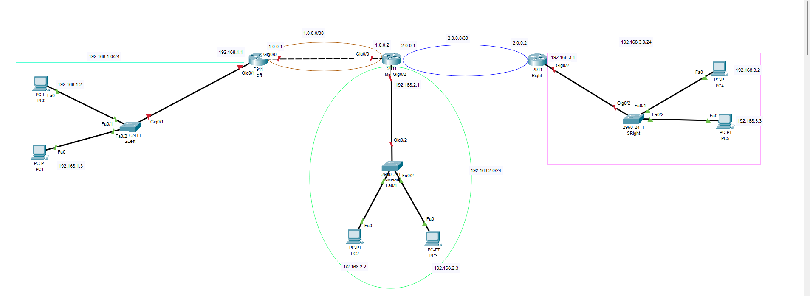
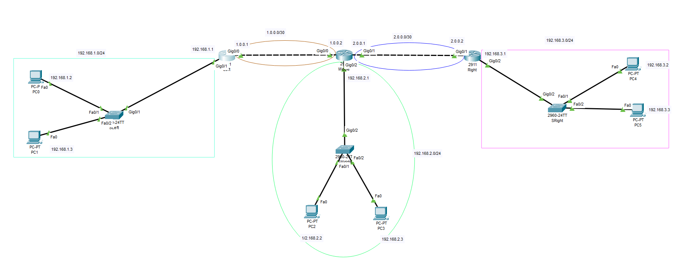

# Static_routing #

```
3x Router
6x PC
3x Switch

1.0.0.0/30 Left-Middle
2.0.0.0/30 Middle-right
192.168.1.0/24  PC0-PC1
192.168.2.0/24  PC2-PC3
192.168.3.0/24  PC4-PC5
```
```
Wir können jetzt bereits alle Geräte einrichten, aber wir verbinden nur Router Left und Router Middle.
Router Right verbinden wir mit Router Middle erst,
wenn wir das statische Routing zwischen Router Left und Router Middle konfiguriert haben.

We can already set up all devices, but we will only connect Router Left and Router Middle.
We will connect Router Right to Router Middle only after we configure static routing between Router Left and Router Middle.
```





**Router 0 (Left)**

```
enable
configure terminal
hostname Left
interface GigabitEthernet0/1
ip address 192.168.1.1 255.255.255.0
no shutdown
exit
interface GigabitEthernet0/0
no shutdown
exit
```

**Router 1 (Middle)**

```
enable
configure terminal
hostname Middle
interface GigabitEthernet0/2
ip address 192.168.2.1 255.255.255.0
no shutdown
exit
interface GigabitEthernet0/0
ip address 1.0.0.2 255.255.255.252
no shutdown
exit
exit
```

**Static routing**


**Router Left**

```
show ip route   
configure terminal
ip route 192.168.2.0 255.255.255.0 1.0.0.2 
```
Das Hinzufügen eines weiteren Netzwerks. Das erste ist das Netzwerk, das wir mit der Maske hinzufügen möchten, und das nächste Netzwerk ist der nächste Hop, an den unser Router Left senden wird.

Adding another network. The first one is the network we want to add with the subnet mask, and the next network is the next hop to which our router Left will send.

**Router Middle**

```
enable
configure terminal
ip route 192.168.1.0 255.255.255.0 1.0.0.1
```

**PC0**
```
C:\>ping 192.168.2.3

Pinging 192.168.2.3 with 32 bytes of data:

Reply from 192.168.2.3: bytes=32 time<1ms TTL=126
Reply from 192.168.2.3: bytes=32 time<1ms TTL=126
Reply from 192.168.2.3: bytes=32 time<1ms TTL=126
Reply from 192.168.2.3: bytes=32 time<1ms TTL=126

Ping statistics for 192.168.2.3:
    Packets: Sent = 4, Received = 4, Lost = 0 (0% loss),
Approximate round trip times in milli-seconds:
    Minimum = 0ms, Maximum = 0ms, Average = 0ms

```


**Two new Network**

```
Connect together Router Middle and Router Right 
```





**Router Middle**
```
enable
configure terminal
interface GigabitEthernet0/1
ip address 2.0.0.1 255.255.255.252
no shutdown
exit
```

**Router Right**
```
enable
configure terminal
hostname Right
interface GigabitEthernet0/1
ip address 2.0.0.2 255.255.255.252
no shutdown
exit
ip address 192.168.3.1 255.255.255.0
no shutdown
exit
show ip route
```
```
     2.0.0.0/8 is variably subnetted, 2 subnets, 2 masks
C       2.0.0.0/30 is directly connected, GigabitEthernet0/1
L       2.0.0.2/32 is directly connected, GigabitEthernet0/1
     192.168.3.0/24 is variably subnetted, 2 subnets, 2 masks
C       192.168.3.0/24 is directly connected, GigabitEthernet0/2
L       192.168.3.1/32 is directly connected, GigabitEthernet0/2
```
**Router Middle**

```
ip route 192.168.3.0 255.255.255.0 2.0.0.2
copy running-config startup-config
do show ip route
     1.0.0.0/8 is variably subnetted, 2 subnets, 2 masks
C       1.0.0.0/30 is directly connected, GigabitEthernet0/0
L       1.0.0.2/32 is directly connected, GigabitEthernet0/0
     2.0.0.0/8 is variably subnetted, 2 subnets, 2 masks
C       2.0.0.0/30 is directly connected, GigabitEthernet0/1
L       2.0.0.1/32 is directly connected, GigabitEthernet0/1
S    192.168.1.0/24 [1/0] via 1.0.0.1
     192.168.2.0/24 is variably subnetted, 2 subnets, 2 masks
C       192.168.2.0/24 is directly connected, GigabitEthernet0/2
L       192.168.2.1/32 is directly connected, GigabitEthernet0/2
S    192.168.3.0/24 [1/0] via 2.0.0.2
```


**Router Left**
```
enable
configure terminal
ip route 192.168.3.0 255.255.255.0 1.0.0.2
ip route 2.0.0.0 255.255.255.252 1.0.0.2
exit
exit
copy running-config startup-config


Höchstens ein Hop im Netzwerk, das der Router kennt.

A maximum of one hop in the network that the router knows.
```
**Router Right**

```
enable
configure terminal
ip route 192.168.1.0 255.255.255.0 2.0.0.1
ip route 192.168.2.0 255.255.255.0 2.0.0.1
ip route 1.0.0.0 255.255.255.252 2.0.0.1
exit
exit
copy running-config startup-config
```
#Control
```
Jeder Router muss alle fünf Netzwerke haben.
Falls eines fehlt, kann es passieren, dass der Ping zwischen den PCs funktioniert,
aber das Netzwerk selbst nicht direkt erreichbar ist.


Each router must have all five networks. 
If any are missing, it may happen that the ping between PCs works, 
but the network itself may not be directly reachable.
```
**Router Left**
```
show ip route
     1.0.0.0/8 is variably subnetted, 2 subnets, 2 masks
C       1.0.0.0/30 is directly connected, GigabitEthernet0/0
L       1.0.0.1/32 is directly connected, GigabitEthernet0/0
     2.0.0.0/30 is subnetted, 1 subnets
S       2.0.0.0/30 [1/0] via 1.0.0.2
     192.168.1.0/24 is variably subnetted, 2 subnets, 2 masks
C       192.168.1.0/24 is directly connected, GigabitEthernet0/1
L       192.168.1.1/32 is directly connected, GigabitEthernet0/1
S    192.168.2.0/24 [1/0] via 1.0.0.2
S    192.168.3.0/24 [1/0] via 1.0.0.2
```

**Router Middle**
```
show ip route
     1.0.0.0/8 is variably subnetted, 2 subnets, 2 masks
C       1.0.0.0/30 is directly connected, GigabitEthernet0/0
L       1.0.0.2/32 is directly connected, GigabitEthernet0/0
     2.0.0.0/8 is variably subnetted, 2 subnets, 2 masks
C       2.0.0.0/30 is directly connected, GigabitEthernet0/1
L       2.0.0.1/32 is directly connected, GigabitEthernet0/1
S    192.168.1.0/24 [1/0] via 1.0.0.1
     192.168.2.0/24 is variably subnetted, 2 subnets, 2 masks
C       192.168.2.0/24 is directly connected, GigabitEthernet0/2
L       192.168.2.1/32 is directly connected, GigabitEthernet0/2
S    192.168.3.0/24 [1/0] via 2.0.0.2
```
**Router Right**
```
show ip route

     1.0.0.0/30 is subnetted, 1 subnets
S       1.0.0.0/30 [1/0] via 2.0.0.1
     2.0.0.0/8 is variably subnetted, 2 subnets, 2 masks
C       2.0.0.0/30 is directly connected, GigabitEthernet0/1
L       2.0.0.2/32 is directly connected, GigabitEthernet0/1
S    192.168.1.0/24 [1/0] via 2.0.0.1
S    192.168.2.0/24 [1/0] via 2.0.0.1
     192.168.3.0/24 is variably subnetted, 2 subnets, 2 masks
C       192.168.3.0/24 is directly connected, GigabitEthernet0/2
L       192.168.3.1/32 is directly connected, GigabitEthernet0/2
```


